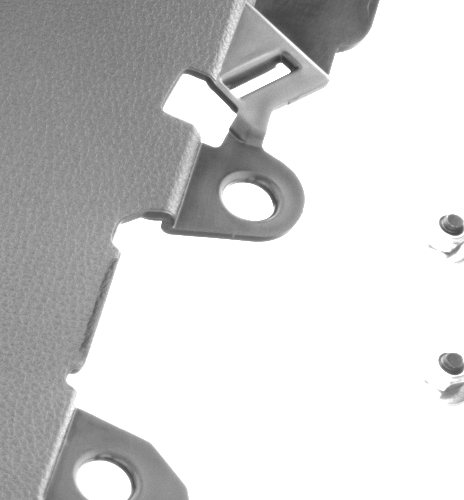
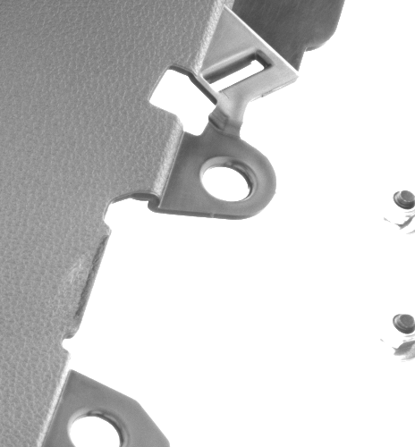

# Proyecto DP-Antolin-IA - Documentación Completa

## Documentación General del Dataset — DP-Antolin-IA

Este documento describe el **dataset visual** utilizado en el reto de inspección automática de piezas plásticas del proyecto **DP-Antolin-IA**. Es el recurso fundamental que permite entrenar y validar el modelo de **detección de anomalías** mediante visión artificial (*PatchCore*).

---

## 1. Propósito del Dataset

El dataset se utiliza para **aprender la normalidad** y detectar piezas que se desvíen del patrón esperado.

*Beneficios:*

* Disminuye **desperdicio de material** en fabricación
* Reduce **rechazos** y retrabajos
* Mejora la **calidad** de inspección
* Alineado con enfoque de **sostenibilidad industrial**

---

## 2. Contenido del Dataset

| Tipo de imagen | Cantidad | Descripción                             |
| -------------- | -------- | --------------------------------------- |
| Sin defecto    | 156      | Ejemplos de normalidad                  |
| Con defecto    | 45       | Regiones anómalas marcadas en polígonos |
| **TOTAL**      | **201**  | Imágenes de producción real             |

*Características técnicas:*

* Resolución media: **Aprox. 500x500 px**
* Captura con **cámara fija**
* Variación ligera de posición por manipulación robótica

Etiquetado de defectos:

* Anotaciones en **JSON** por imagen con **polígonos**
* Estándar **LabelMe**
* Mismo nombre para imagen y anotación

### Ejemplos Visuales del Dataset

| Normal | Defecto |
|--------|---------|
|  |  |

---

## 3. Ubicación y Organización en el Proyecto
Dataset/ ├─ dataset_gua_crops/cropped_images # Imágenes + anotaciones JSON 
└─ dataset_gua_crops.zip # Versión comprimida

Uso dentro del sistema:

* Entrenamiento del **memory bank** de PatchCore
* Entrada directa al endpoint `POST /predict` (backend)
* Visualización en el **frontend** de inspección

---

## 4. Relación con PatchCore (Backend)

PatchCore utiliza el dataset así:
1. Aprende características de imágenes **normales**
2. Construye un **memory bank** -> embeddings de normalidad
3. Si una nueva imagen **no se parece** -> es anómala

### Creación Única del "Cerebro" (Memory Bank)

Para que el sistema sea rápido y eficiente, todo el **trabajo pesado se hizo una sola vez** al principio (en un notebook de desarrollo). Fue en ese momento cuando se separaron los datos y se extrajo la información clave de las imágenes.

El resultado de ese proceso es un único archivo fijo: **`memory_bank_core.npz`**.

**¿Cómo funciona en la app final?**
La aplicación **no pierde tiempo aprendiendo de nuevo** ni reorganizando fotos. Simplemente carga ese archivo `.npz` ya listo y lo usa como referencia para juzgar al instante si las piezas nuevas están bien o mal.

El backend devuelve:

* **Score** de anomalía
* **Mapa de calor** (heatmap)
* **Polígonos** detectados
* *(Opcional)* overlays

> Esto permite detectar **defectos desconocidos** que no estaban previamente etiquetados.

---

## 5. Impacto en Sostenibilidad

Gracias a este dataset es posible:

* Detectar defectos **temprano**
* Minimizar **reprocesos y desperdicio**
* Ahorrar recursos y energía

Contribuye directamente a prácticas de **Green Computing** y eficiencia industrial.

---

## Conclusión

Este dataset permite construir un sistema de inspección automatizado **realista, eficiente y sostenible** para la industria automotriz.

Sirve como base para modelos de IA como **PatchCore**, capaces de **aprender normalidad** y detectar anomalías sin necesidad de clasificar defectos específicos.
